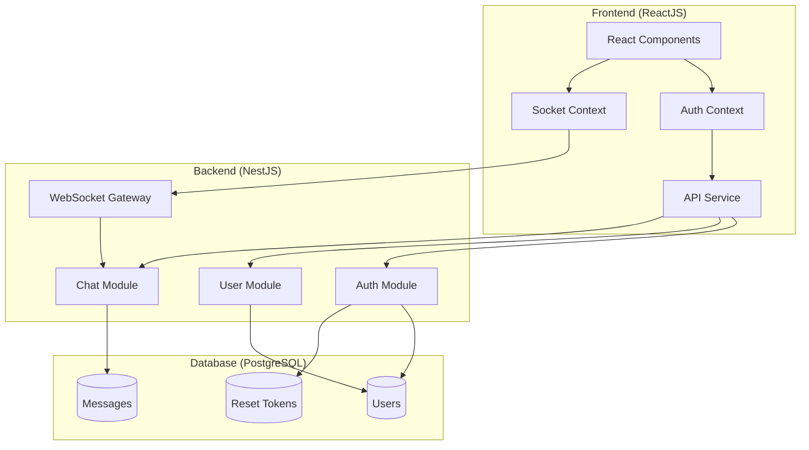
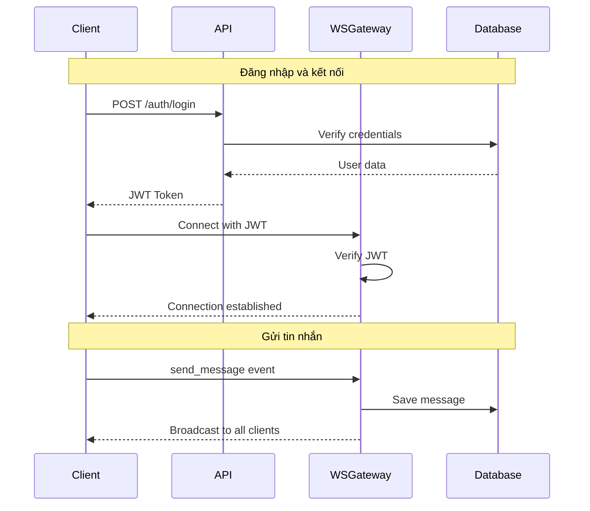
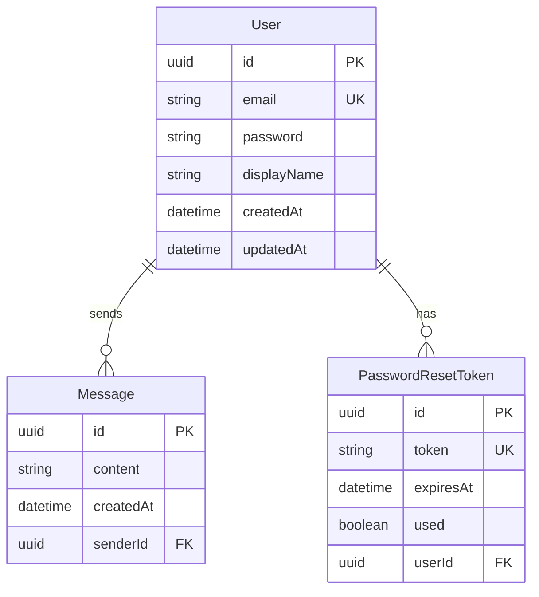

# Tài liệu Thiết kế

## Tổng quan

Ứng dụng chat realtime được xây dựng theo kiến trúc client-server với:
- **Backend**: NestJS framework với WebSocket Gateway (Socket.IO)
- **Frontend**: ReactJS với hooks và context
- **Database**: PostgreSQL với Prisma ORM
- **Authentication**: JWT-based authentication

Hệ thống cho phép người dùng đăng ký, đăng nhập và tham gia chat trong một kênh toàn cầu với tin nhắn realtime.

## Kiến trúc



### Luồng dữ liệu



## Components và Interfaces

### Backend Components

#### AuthModule

```typescript
// auth.controller.ts
interface AuthController {
  register(dto: RegisterDto): Promise<{ message: string }>;
  login(dto: LoginDto): Promise<{ accessToken: string }>;
  forgotPassword(dto: ForgotPasswordDto): Promise<{ message: string }>;
  resetPassword(dto: ResetPasswordDto): Promise<{ message: string }>;
  changePassword(dto: ChangePasswordDto, user: User): Promise<{ message: string }>;
}

// DTOs
interface RegisterDto {
  email: string;      // Valid email format
  password: string;   // Min 8 characters
  displayName: string;
}

interface LoginDto {
  email: string;
  password: string;
}

interface ForgotPasswordDto {
  email: string;
}

interface ResetPasswordDto {
  token: string;
  newPassword: string;  // Min 8 characters
}

interface ChangePasswordDto {
  currentPassword: string;
  newPassword: string;  // Min 8 characters
}
```

#### UserModule

```typescript
// user.controller.ts
interface UserController {
  getProfile(user: User): Promise<UserProfileDto>;
  updateProfile(dto: UpdateProfileDto, user: User): Promise<UserProfileDto>;
}

interface UserProfileDto {
  id: string;
  email: string;
  displayName: string;
  createdAt: Date;
}

interface UpdateProfileDto {
  displayName: string;  // Non-empty string
}
```

#### ChatModule và WebSocket Gateway

```typescript
// chat.gateway.ts
interface ChatGateway {
  handleConnection(client: Socket): void;
  handleDisconnect(client: Socket): void;
  handleSendMessage(client: Socket, payload: SendMessageDto): void;
}

interface SendMessageDto {
  content: string;  // 1-1000 characters, non-whitespace
}

// chat.service.ts
interface ChatService {
  createMessage(userId: string, content: string): Promise<Message>;
  getRecentMessages(limit: number): Promise<Message[]>;
}

// Message response
interface MessageDto {
  id: string;
  content: string;
  senderDisplayName: string;
  senderId: string;
  createdAt: Date;
}
```

### Frontend Components

#### Auth Context

```typescript
interface AuthContextValue {
  user: User | null;
  isAuthenticated: boolean;
  isLoading: boolean;
  login: (email: string, password: string) => Promise<void>;
  register: (email: string, password: string, displayName: string) => Promise<void>;
  logout: () => void;
}
```

#### Socket Context

```typescript
interface SocketContextValue {
  socket: Socket | null;
  isConnected: boolean;
  sendMessage: (content: string) => void;
  messages: Message[];
}
```

#### React Components

```
src/
├── components/
│   ├── auth/
│   │   ├── LoginForm.tsx
│   │   ├── RegisterForm.tsx
│   │   ├── ForgotPasswordForm.tsx
│   │   └── ResetPasswordForm.tsx
│   ├── chat/
│   │   ├── ChatContainer.tsx
│   │   ├── MessageList.tsx
│   │   ├── MessageItem.tsx
│   │   └── MessageInput.tsx
│   └── profile/
│       └── ProfileForm.tsx
├── contexts/
│   ├── AuthContext.tsx
│   └── SocketContext.tsx
├── services/
│   └── api.ts
└── pages/
    ├── LoginPage.tsx
    ├── RegisterPage.tsx
    ├── ChatPage.tsx
    └── ProfilePage.tsx
```

## Data Models

### Prisma Schema

```prisma
model User {
  id           String   @id @default(uuid())
  email        String   @unique
  password     String
  displayName  String
  createdAt    DateTime @default(now())
  updatedAt    DateTime @updatedAt
  
  messages     Message[]
  resetTokens  PasswordResetToken[]
}

model Message {
  id        String   @id @default(uuid())
  content   String   @db.VarChar(1000)
  createdAt DateTime @default(now())
  
  senderId  String
  sender    User     @relation(fields: [senderId], references: [id])
  
  @@index([createdAt])
}

model PasswordResetToken {
  id        String   @id @default(uuid())
  token     String   @unique
  expiresAt DateTime
  used      Boolean  @default(false)
  createdAt DateTime @default(now())
  
  userId    String
  user      User     @relation(fields: [userId], references: [id])
  
  @@index([token])
}
```

### Entity Relationships




## Correctness Properties

*Một property là một đặc tính hoặc hành vi phải đúng trong mọi trường hợp thực thi hợp lệ của hệ thống - về cơ bản là một tuyên bố chính thức về những gì hệ thống phải làm. Properties đóng vai trò là cầu nối giữa đặc tả có thể đọc được và đảm bảo tính đúng đắn có thể kiểm chứng bằng máy.*

### Authentication Properties

**Property 1: Registration creates valid account**
*Với mọi* email hợp lệ và mật khẩu >= 8 ký tự, đăng ký phải tạo tài khoản mới và có thể đăng nhập với credentials đó.
**Validates: Requirements 1.1, 2.1**

**Property 2: Invalid email format rejection**
*Với mọi* chuỗi không đúng định dạng email, đăng ký phải bị từ chối với lỗi validation.
**Validates: Requirements 1.3**

**Property 3: Short password rejection**
*Với mọi* mật khẩu có độ dài < 8 ký tự, đăng ký và đổi mật khẩu phải bị từ chối.
**Validates: Requirements 1.4, 4.3**

**Property 4: Password hashing**
*Với mọi* tài khoản được tạo hoặc mật khẩu được đổi, mật khẩu lưu trong database phải khác với plaintext và phải là bcrypt hash hợp lệ.
**Validates: Requirements 1.5, 4.4, 10.1**

**Property 5: Login round-trip**
*Với mọi* tài khoản đã đăng ký với email E và password P, đăng nhập với E và P phải trả về JWT token hợp lệ.
**Validates: Requirements 2.1**

### Password Reset Properties

**Property 6: Reset token enables password change**
*Với mọi* user và reset token hợp lệ (chưa hết hạn, chưa sử dụng), đặt mật khẩu mới phải thành công.
**Validates: Requirements 3.3**

**Property 7: Reset token single-use**
*Với mọi* reset token đã được sử dụng, sử dụng lại token đó phải bị từ chối.
**Validates: Requirements 3.5**

**Property 8: Change password with valid credentials**
*Với mọi* user đã xác thực, nếu cung cấp đúng mật khẩu hiện tại và mật khẩu mới hợp lệ, đổi mật khẩu phải thành công.
**Validates: Requirements 4.1**

### Profile Properties

**Property 9: Profile retrieval**
*Với mọi* user đã xác thực, truy vấn profile phải trả về đúng thông tin (id, email, displayName).
**Validates: Requirements 5.1**

**Property 10: Profile update with valid displayName**
*Với mọi* displayName không rỗng, cập nhật profile phải thành công và lưu giá trị mới.
**Validates: Requirements 5.2**

**Property 11: Empty displayName rejection**
*Với mọi* chuỗi rỗng hoặc chỉ chứa whitespace, cập nhật displayName phải bị từ chối.
**Validates: Requirements 5.3**

### WebSocket Properties

**Property 12: WebSocket connection with valid JWT**
*Với mọi* JWT token hợp lệ (chưa hết hạn), kết nối WebSocket phải được chấp nhận.
**Validates: Requirements 6.2**

**Property 13: WebSocket connection with invalid JWT**
*Với mọi* JWT token không hợp lệ hoặc đã hết hạn, kết nối WebSocket phải bị từ chối.
**Validates: Requirements 6.3, 10.3**

### Message Properties

**Property 14: Valid message is saved and broadcast**
*Với mọi* nội dung tin nhắn hợp lệ (1-1000 ký tự, không chỉ whitespace), tin nhắn phải được lưu vào database và broadcast đến tất cả clients.
**Validates: Requirements 7.1**

**Property 15: Invalid message content rejection**
*Với mọi* nội dung tin nhắn rỗng, chỉ chứa whitespace, hoặc > 1000 ký tự, gửi tin nhắn phải bị từ chối.
**Validates: Requirements 7.2, 7.4**

**Property 16: Message metadata**
*Với mọi* tin nhắn được lưu, phải có đầy đủ thông tin: senderId, senderDisplayName, createdAt.
**Validates: Requirements 7.3**

**Property 17: Recent messages retrieval**
*Với mọi* yêu cầu lấy tin nhắn gần đây với limit N, kết quả phải trả về tối đa N tin nhắn, sắp xếp theo thời gian tăng dần.
**Validates: Requirements 8.3**

### JWT Properties

**Property 18: JWT expiry configuration**
*Với mọi* JWT token được tạo, thời gian hết hạn phải là 24 giờ kể từ thời điểm tạo.
**Validates: Requirements 10.2**

## Error Handling

### Backend Error Handling

| Error Type | HTTP Status | Response Format |
|------------|-------------|-----------------|
| Validation Error | 400 | `{ "statusCode": 400, "message": ["error details"], "error": "Bad Request" }` |
| Unauthorized | 401 | `{ "statusCode": 401, "message": "Unauthorized", "error": "Unauthorized" }` |
| Not Found | 404 | `{ "statusCode": 404, "message": "Resource not found", "error": "Not Found" }` |
| Conflict (Duplicate) | 409 | `{ "statusCode": 409, "message": "Email already exists", "error": "Conflict" }` |
| Internal Error | 500 | `{ "statusCode": 500, "message": "Internal server error", "error": "Internal Server Error" }` |

### WebSocket Error Handling

| Event | Error Response |
|-------|----------------|
| Invalid token | Disconnect with error message |
| Invalid message | Emit `error` event with validation details |
| Server error | Emit `error` event with generic message |

### Frontend Error Handling

- Hiển thị toast notification cho user-facing errors
- Redirect đến login page khi token hết hạn
- Retry logic cho network errors (max 3 attempts)
- Graceful degradation khi WebSocket disconnect

## Testing Strategy

### Unit Tests

Unit tests sẽ được viết cho:
- **Validation functions**: Email format, password length, message content
- **Service methods**: AuthService, UserService, ChatService
- **Utility functions**: Token generation, password hashing

### Property-Based Tests

Sử dụng **fast-check** library cho TypeScript property-based testing.

Mỗi property test phải:
- Chạy tối thiểu 100 iterations
- Reference property number từ design document
- Tag format: `Feature: realtime-chat-app, Property N: [property title]`

**Property tests sẽ cover:**
- Registration/Login round-trip (Property 1, 5)
- Password validation (Property 3)
- Password hashing verification (Property 4)
- Message content validation (Property 15)
- Message metadata (Property 16)
- Recent messages ordering (Property 17)

### Integration Tests

- API endpoint tests với supertest
- WebSocket connection tests
- Database operations với test database

### Test Configuration

```typescript
// jest.config.js
module.exports = {
  testEnvironment: 'node',
  testMatch: ['**/*.spec.ts', '**/*.test.ts'],
  collectCoverageFrom: ['src/**/*.ts'],
  coverageThreshold: {
    global: {
      branches: 70,
      functions: 70,
      lines: 70,
    },
  },
};
```
